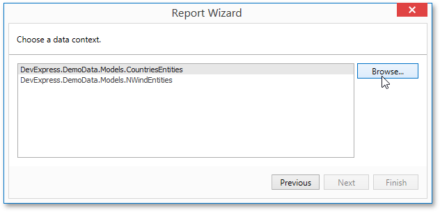
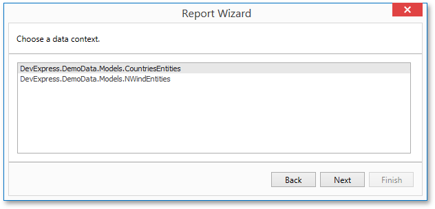

<!-- default badges list -->

<!-- default badges end -->

# Reporting for WPF - How to Enable End Users to Load Custom Assemblies to the Entity Framework Context

In the **Data Source wizard**, it is possible to load custom assemblies by using the Browse button on the [Select the Data Context](https://docs.devexpress.com/XtraReports/114856/desktop-reporting/wpf-reporting/end-user-report-designer-for-wpf/gui/data-source-wizard/connect-to-an-entity-framework-data-source/select-the-data-context) page.

In the End-User Designer, this button is hidden by default, so that end-users are allowed only to select the data context from assemblies referenced by the project.

This example illustrates how to enable this functionality in the End-User Report Designer for WPF.

## Files to Review

* [MainWindow.xaml](./CS/MainWindow.xaml) (VB: [MainWindow.xaml](./VB/MainWindow.xaml))
* [MainWindow.xaml.cs](./CS/MainWindow.xaml.cs) (VB: [MainWindow.xaml.vb](./VB/MainWindow.xaml.vb))
* [UseDataSourceWizardSettings.xaml](./CS/UseDataSourceWizardSettings.xaml) (VB: [UseDataSourceWizardSettings.xaml](./VB/UseDataSourceWizardSettings.xaml))
* [UseDataSourceWizardSettings.xaml.cs](./CS/UseDataSourceWizardSettings.xaml.cs) (VB: [UseDataSourceWizardSettings.xaml.vb](./VB/UseDataSourceWizardSettings.xaml.vb))
* [UseEFOptionsAndCustomization.xaml](./CS/UseEFOptionsAndCustomization.xaml) (VB: [UseEFOptionsAndCustomization.xaml](./VB/UseEFOptionsAndCustomization.xaml))
* [UseEFOptionsAndCustomization.xaml.cs](./CS/UseEFOptionsAndCustomization.xaml.cs) (VB: [UseEFOptionsAndCustomization.xaml.vb](./VB/UseEFOptionsAndCustomization.xaml.vb))

## Documentation

* [Data Access Security](https://docs.devexpress.com/XtraReports/117318/desktop-reporting/common-features/security/wpf-reporting-application-security/data-access-security)
* [Safe Deserialization](https://docs.devexpress.com/GeneralInformation/404441/security/safe-deserialization)
<!-- feedback -->
## Does this example address your development requirements/objectives?

 

(you will be redirected to DevExpress.com to submit your response)
<!-- feedback end -->
